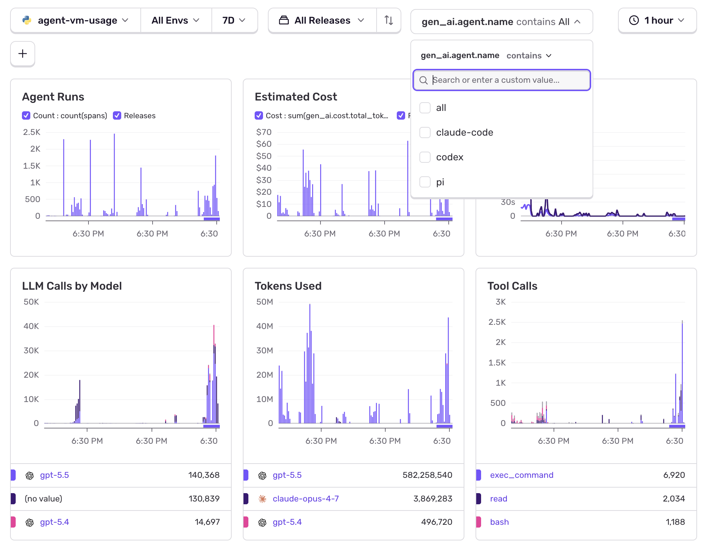
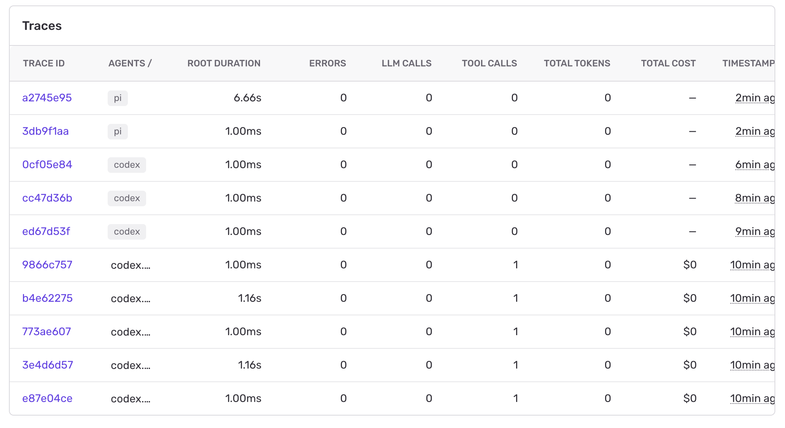

# Coding Agent Sentry Observability

One dashboard for your coding agents.

This tool watches local telemetry from **Codex**, **Claude Code**, and **Pi**, stores a private local history in SQLite, and can send clean usage traces to **Sentry**.

Use it to answer simple questions:

- Which agent is running right now?
- How many LLM calls happened?
- Which model is being used?
- How many tokens did we spend?
- What did it cost?
- Which tool calls or failures happened?

## Screenshots

### Sentry usage dashboard



### Sentry traces view



## What it does

```text
Codex / Claude Code / Pi logs
        ↓
agent-vm bridge
        ↓
local SQLite memory database
        ↓
local dashboard + memory commands
        ↓
optional Sentry dashboards and traces
```

The local database is the source of truth. Sentry export is optional.

## Supported agents

| Agent | Source |
| --- | --- |
| Codex | `~/.codex/logs_2.sqlite`, `~/.codex/state_5.sqlite` |
| Claude Code | `~/.claude/projects/**/*.jsonl` |
| Pi | `~/.pi/suggester/logs/events.ndjson` and project-local `.pi/suggester` logs |

## Install

```bash
git clone https://github.com/zonko-ai/coding-agent-sentry-observability.git
cd coding-agent-sentry-observability
./scripts/install.sh
```

The installer:

1. creates `.venv`
2. installs `agent-vm`
3. creates `~/.config/coding-agent-sentry-observability/env`
4. imports the last 7 days of local agent history

To skip the first import:

```bash
AGENT_VM_INSTALL_SKIP_BACKFILL=1 ./scripts/install.sh
```

## Start collecting live data

Run in the background on macOS:

```bash
agent-vm start-launchd
```

Or run in the foreground:

```bash
agent-vm bridge --loop
```

Check it:

```bash
agent-vm status
```

## Local dashboard

```bash
agent-vm dashboard --port 8765
```

Open:

```text
http://127.0.0.1:8765
```

This works without Sentry.

## Sentry setup

Edit:

```bash
~/.config/coding-agent-sentry-observability/env
```

Set these values:

```bash
SENTRY_DSN=...
SENTRY_ORG=...
SENTRY_PROJECT=agent-vm-usage
SENTRY_PROJECT_ID=...
SENTRY_AUTH_TOKEN=...   # only needed to create/update dashboards
```

Apply the Sentry dashboard:

```bash
agent-vm sentry apply-dashboards
```

Backfill history into Sentry:

```bash
agent-vm backfill --minutes 10080
```

`10080` minutes is 7 days.

## Useful commands

| Command | What it does |
| --- | --- |
| `agent-vm status` | Show config, service state, and recent usage |
| `agent-vm start-launchd` | Start the background collector on macOS |
| `agent-vm stop-launchd` | Stop the background collector |
| `agent-vm bridge --loop` | Run the collector in the foreground |
| `agent-vm backfill --minutes 60` | Import/export the last hour |
| `agent-vm dashboard --port 8765` | Start the local dashboard |
| `agent-vm sentry apply-dashboards` | Create or update Sentry dashboards |
| `agent-vm memory search "query"` | Search local agent memory |
| `agent-vm memory context --cwd /repo --agent codex` | Print useful local context for an agent |

## What gets tracked

- agent name: `codex`, `claude-code`, `pi`
- model name when available
- LLM calls
- token counts
- estimated or exact cost when available
- sessions and projects
- tool calls
- durations
- failures
- recent memory and session summaries

## Privacy defaults

The default setup is local-first and text-minimizing.

By default:

- raw prompt text is not exported
- raw response text is not exported
- text previews are stored as length/hash summaries
- common secrets and emails are redacted
- local path tags sent to Sentry are hashed
- the local SQLite database stays on your machine

Read more in [docs/PRIVACY.md](docs/PRIVACY.md).

## Configuration

Main config file:

```text
~/.config/coding-agent-sentry-observability/env
```

Common settings:

| Variable | Default | Meaning |
| --- | --- | --- |
| `SENTRY_DSN` | empty | Enables Sentry export |
| `SENTRY_ORG` | empty | Sentry org slug |
| `SENTRY_PROJECT` | `agent-vm-usage` | Sentry project slug |
| `SENTRY_PROJECT_ID` | empty | Numeric Sentry project id |
| `AGENT_VM_MEMORY_DB` | `~/.coding-agent-sentry-observability/memory.db` | Local SQLite database |
| `AGENT_VM_POLL_SECONDS` | `15` | Live collector poll interval |
| `AGENT_VM_RECORD_MEMORY` | `1` | Store normalized traces locally |
| `AGENT_SENTRY_INCLUDE_TEXT` | `0` | Opt into redacted text export |

Full details: [docs/CONFIGURATION.md](docs/CONFIGURATION.md).

## Troubleshooting

Check whether the background collector is running:

```bash
agent-vm status
```

Watch recent bridge logs:

```bash
tail -f ~/Library/Logs/coding-agent-sentry-observability/bridge.out.log
```

Check errors:

```bash
tail -f ~/Library/Logs/coding-agent-sentry-observability/bridge.err.log
```

Send a test event:

```bash
agent-vm self-test
```

Run a dry-run backfill:

```bash
agent-vm backfill --minutes 5 --dry-run
```

## Development

```bash
. .venv/bin/activate
python -m pytest
python -m agent_vm_observability status
python -m agent_vm_observability backfill --minutes 5 --dry-run
```

## Docs

- [Architecture](docs/ARCHITECTURE.md)
- [Configuration](docs/CONFIGURATION.md)
- [Privacy](docs/PRIVACY.md)

## License

MIT. See [LICENSE](LICENSE).
